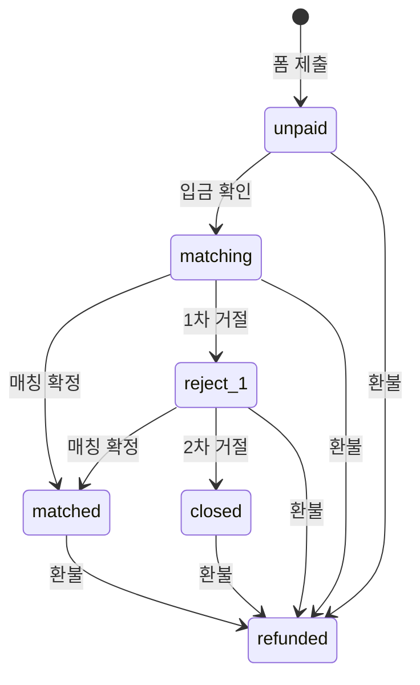

# CRM 상태 머신

> 코드: `utils/crm_truth.applicant_stage()` · `utils/crm_state.py`

## 상태 (stage_key)

| key | 라벨 | 시트 조건 |
|-----|------|-----------|
| `invalid` | — | 성함 없음 |
| `unpaid` | 입금 대기 | 성함 O · 입금 미체크 · 환불 X |
| `matching` | 매칭 진행 | 입금 O · 매칭 X · 거절 0 |
| `reject_1` | 1차 거절 · 재매칭 | 입금 O · 거절 1 |
| `matched` | 매칭 완료 | matched=TRUE · 환불 X |
| `closed` | 종료(거절 2회) | 거절 ≥ 2 · 환불 X · 매칭 X |
| `refunded` | 환불 | refund=TRUE (최우선) |

## 허용 전이

## UI 검증

- `do_match` → `validate_match()`
- `do_reject` → `validate_reject_increment()`
- 불가 전이 → `st.error` (flash_error)

## 금지 예

- 입금 대기 → 매칭 확정
- 매칭 완료 → 거절 추가
- 종료(2회) → 거절 추가
- 환불 → 어떤 forward 전이도 불가
